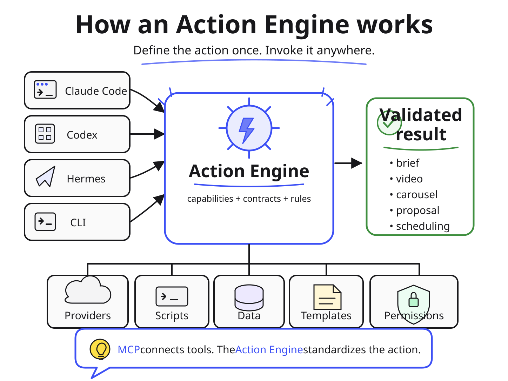
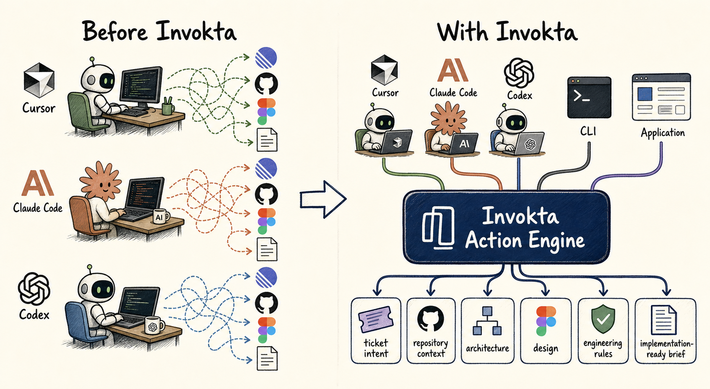
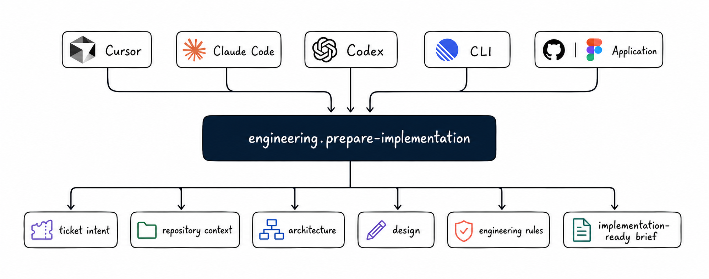

# Invokta

**Stop teaching every AI agent the same process.**

Invokta turns repeatable AI-assisted work—preparing implementation, creating a specification, reviewing code, editing videos, producing on-brand carousels, generating commercial proposals, scheduling appointments, or screening candidates—into reusable actions that agents, applications, automations, and people can invoke.

Instead of copying prompts, skills, tool instructions, validation, permissions,
and output rules into every harness, define the action once. Cursor, Claude Code,
Codex, application code, and automations all reach the same validated
implementation through direct calls, the CLI, or MCP.

**Build the task once. Invoke it anywhere.**

Invokta is the TypeScript framework for building these reusable actions. We call
them [Action Engines](./docs/action-engines.md).

## How an Action Engine works



Claude Code, Codex, Hermes, and the CLI can invoke the same domain action. The
engine owns the providers, scripts, data, templates, permissions, contracts, and
rules required to return a validated result.

## The problem Invokta solves

A useful AI process rarely lives in one place. For example, preparing a ticket
for implementation may require intent from Linear or Jira, repository context,
architecture decisions, Figma designs, and internal engineering rules.

Without an owned action, every harness needs the same integrations and a copy of
the instructions:



The first setup ships quickly. The copies then drift: tools are called
differently, permissions and validation change, and each agent may produce a
different shape of result.

With Invokta, every consumer invokes one domain outcome:

```text
Cursor ───────┐
Claude Code ──┤
Codex ────────┤
CLI ──────────┼──> engineering.prepare-implementation
Application ──┘                  |
                                  ├── ticket intent
                                  ├── repository context
                                  ├── architecture
                                  ├── design
                                  ├── engineering rules
                                  └── implementation-ready brief
```



The Action Engine owns how that brief is produced. Its model, prompts, tools,
data sources, and providers can change without teaching every consumer the
process again.

> MCP connects tools and data. Prompts, rules, and skills guide agent behavior.
> Invokta gives the reusable action one implementation, contract, and execution
> boundary.

## What an Action Engine can own

An engine may publish several related capabilities around one domain. Provider
APIs, local scripts, templates, design-system files, and SaaS schemas remain
replaceable implementation details rather than instructions copied into every
agent.

| Example engine | Capabilities | Engine-owned integrations and rules | Durable outcome |
| --- | --- | --- | --- |
| Video Production Engine | `video.transcribe-source`, `video.plan-edit`, `video.generate-voiceover`, `video.generate-visual`, `video.generate-cutscene`, `video.apply-edit` | ElevenLabs STT, Cartesia TTS, GPT Image 2.0, Seedance 2.0, brand pacing, and trusted scripts for cuts, zooms, captions, mixing, and rendering | A transcript, edit plan, generated assets, and rendered video with evidence |
| Social Carousel Engine | `carousel.prepare-series`, `carousel.render-series`, `carousel.assess-readiness` | Approved carousel formats, hook and CTA policy, Figma or design-system references, and a GPT Image 2.0 adapter | An ordered, on-brand carousel that is ready to publish or has explicit blockers |
| Commercial Proposal Engine | `sales.prepare-proposal`, `sales.render-proposal`, `sales.assess-proposal-readiness` | CRM context, approved pricing and claims, the existing proposal template, case studies, and visual identity | A customer-specific proposal and a readiness decision |
| Appointment Scheduling Engine | `appointments.list-valid-slots`, `appointments.schedule`, `appointments.reschedule`, `appointments.cancel` | Clinic rules, authorization, buffers, and an authorized Google Calendar adapter | Valid appointment options and a confirmed calendar write or stable conflict |
| Recruiting and Selection Engine | `recruiting.screen-candidate`, `recruiting.record-screening`, `recruiting.notify-review` | The job rubric, candidate responses, the recruiting system, review thresholds, and Slack notifications | An evidence-backed screening record and a human-review notification |

The consumer still decides which capability to call and in what order. Invokta
does not become a workflow engine; it gives each domain action one validated,
reusable execution boundary.

Browse [use cases by company area](./apps/docs/src/content/docs/use-cases/index.mdx)
for detailed examples across content and creative, engineering, product,
marketing, sales, healthcare operations, recruiting, support, and operations.

## Why Action Engines matter

The result of an action is the durable asset. MCP, CLI, HTTP, and direct APIs are
delivery paths that let consumers reach it.

Many projects still begin with the delivery path. Each use case gets its own MCP
server, CLI parsing, schema conversion, authentication, error mapping,
cancellation, and logging. AI makes the first integration faster to build, while
long-term ownership still includes security, tests, protocol upgrades, and
keeping every interface consistent.

We keep seeing the same pattern: the first integration ships quickly, then a
second agent or interface exposes decisions shaped around the original
transport. Teams revisit schemas, authorization, errors, and business rules, and
sometimes rebuild the feature around a stable domain boundary.

An Action Engine gives that behavior its own boundary. For example,
`support.classify-ticket` can validate the same request, enforce the same access
rule, and return the same result whether it is called by an agent, a workflow,
application code, the CLI, or MCP. The model, prompt, retrieval strategy, and
provider can change inside the engine without forcing every consumer to change.

This boundary makes a domain action:

- reusable across consumers and execution channels;
- testable without running a complete agent or workflow;
- governed by explicit input, output, access, and failure contracts; and
- independently owned and versioned as its implementation evolves.

## Where Action Engines fit

Prompts, rules, and skills guide behavior, while loops and graphs coordinate it.
Action Engines give the domain behavior they invoke a stable execution boundary.

```text
agent, application, or automation
  guided by prompts, rules, and skills
  coordinated by loops and graphs
  invokes Action Engines
    which use models, prompts, data, tools, and services internally
```

| Concept | What it owns | Relationship to an Action Engine |
| --- | --- | --- |
| Prompt | Instructions and context for a model call | May help a consumer choose an action or implement part of a capability inside the engine |
| Rule | A constraint, permission, or deterministic decision | May govern when an action is selected or be enforced by the engine as access or domain policy |
| Skill | Packaged instructions, knowledge, and resources for an agent | Teaches an agent when and how to invoke an action without owning the action's runtime contract |
| Loop | The decision to continue, stop, or choose the next action | Invokes Action Engines while retaining control of iteration and stopping conditions |
| Graph | Nodes, dependencies, branches, and execution order | Uses Action Engines as contracted nodes without absorbing their domain implementation |
| Action Engine | A reusable domain outcome with runtime-validated contracts, access, execution, and stable failures | Provides the callable boundary shared by agents, applications, loops, graphs, and interfaces |

The same system can use all six concepts. The separation lets orchestration and
agent behavior change without duplicating the domain action, while the engine
can change its AI implementation without rewriting its consumers. See the
[framework-neutral category definition](./docs/action-engines.md) for the full
conceptual model.

## What Invokta provides

Invokta makes the action contract the starting point and provides the reusable
framework layer around it. Define the capability once with its input, output,
access rule, and execution behavior; Invokta runs it through the same validated
pipeline from application code, the CLI, or MCP.

Use that boundary to build engines for media production, implementation
planning, context retrieval, code review, campaign production, document
generation, appointment scheduling, recruiting, support operations, or another
domain outcome. Your team owns the domain contract, business rules, prompts,
models, data integrations, scripts, templates, evaluations, and outcome quality.
Invokta supplies the shared runtime mechanics and delivery adapters:

- `@invokta/core` defines capabilities, validates Standard Schema input and
  output, enforces access rules, propagates cancellation, and emits minimal
  invocation events;
- `@invokta/cli` provides `list`, `describe`, and `run` without bypassing
  `engine.invoke`;
- `@invokta/mcp` publishes capabilities as tools over stdio and secure
  stateless HTTP while keeping the official MCP SDK behind the adapter boundary;
- `@invokta/tooling` validates composed capabilities during development;
- `@invokta/devtools` provides a workspace-independent MCP workbench for stdio
  and Streamable HTTP targets, including ephemeral interactive OAuth, plus a
  built-engine inspector with invocation playground, live trace, doctor
  diagnostics, principal switching, and watch by process replacement;
- `@invokta/installer` detects supported local MCP clients, installs local or
  remote Action Engines across selected clients, and manages those entries;
- `@invokta/deploy` scaffolds and packages stateless HTTP engines and probes
  deployed endpoints;
- `create-invokta-engine` creates a `complete`, `cli`, `mcp-stdio`, or
  `mcp-http` standalone starter; the `complete` profile includes direct, CLI,
  MCP stdio, and MCP HTTP entry points;
- `create-invokta-capability` creates a standalone atomic capability package;
  and
- `create-invokta-capability-library` creates a standalone capability-library
  package.

Invokta does not provide identity, model routing, an agent harness, a
workflow engine, or a production observability platform. Custom engines inject
their own model, data, tool, authentication, and authorization integrations.

## Start here

Requirements: Node.js 22.20.0 or later and Yarn 1.22.22.

Create a standalone engine:

```sh
npm create invokta-engine@latest my-engine
cd my-engine
npm run check
npm run devtools
# Starts the devtools inspector on http://127.0.0.1:4100/ with watch mode.
npm run mcp:install
# Later, remove the engine from every managed MCP client:
npm run mcp:uninstall
```

`mcp:install` builds the generated engine, detects eligible MCP clients,
preselects them, and asks for one confirmation before updating their user
configuration. `mcp:uninstall` is build-free and removes the same logical engine
from every installer-managed client after one confirmation. See the
[installer reference](./apps/docs/src/content/docs/reference/installer.mdx) for
remote HTTP registration and lifecycle commands.

Create reusable package boundaries directly when an engine is not the owning
project:

```sh
npm create invokta-capability@latest my-capability
npm create invokta-capability-library@latest my-library
```

To work on Invokta itself:

```sh
yarn install --frozen-lockfile
yarn run check
```

Then follow the [getting-started guide](./docs/getting-started.md) or inspect:

- [`hello-engine`](./examples/hello-engine/) for the shortest complete path;
- [`support-engine`](./examples/support-engine/) for dependency injection,
  domain authorization, safe errors, and all four execution channels;
- [`support-harness`](./examples/support-harness/) for a private harness that
  consumes the support capability only through MCP stdio;
- the ten [`auth-*` examples](./examples/), from
  [`auth-jwt-bearer-engine`](./examples/auth-jwt-bearer-engine/) to
  provider-specific engines for Supabase, Clerk, Auth0, Cognito, Firebase,
  Better Auth, Auth.js, WorkOS, and hashed API keys, each verifying credentials
  at the MCP HTTP boundary and mapping them into the minimal `Principal`;
- [`crawl-engine`](./examples/crawl-engine/) for an outbound provider
  integration, crawling the web with Firecrawl behind a port, with target rules
  that run before authorization;
- [`cursor-agent-routing-engine`](./examples/cursor-agent-routing-engine/) for
  deterministic Cursor subagent and model selection by development use case;
- [`image-engine`](./examples/image-engine/) for outcome-based routing across
  GPT Image 2, Seedream 5.0, and Nano Banana 2 behind replaceable domain ports;
- [`obsidian-context-engine`](./examples/obsidian-context-engine/) for bounded,
  progressive knowledge-graph navigation from Obsidian frontmatter and
  wikilinks through direct, CLI, and MCP entrypoints;
- [`spec-engine`](./examples/spec-engine/) for a spec-driven development
  workflow whose ordering, state, and per-step authorization live in the domain
  rather than in a workflow engine;
- [`agent-session-engine`](./examples/agent-session-engine/) for durable task,
  phase, checkpoint, and handoff state plus CLI-backed hooks for Cursor,
  Antigravity, Claude Code, and Codex;
- [`review-engine`](./examples/review-engine/) for a fail-closed code review,
  acceptance-eval, and adversarial-review gate that tells an agent whether a
  task is ready to be declared complete;
- [`observability-engine`](./examples/observability-engine/) for bounded incident
  context normalized from Sentry, Datadog, and New Relic;
- [`community-capabilities`](./examples/community-capabilities/) for atomic and
  library capability publication forms; and
- [`composed-engine`](./examples/composed-engine/) for combining local, atomic,
  and library capabilities under deliberate effective IDs.

## Documentation

Start with [use cases by company area](./apps/docs/src/content/docs/use-cases/index.mdx)
to identify a domain outcome worth packaging. Then read the framework-neutral
[Action Engines community definition](./docs/action-engines.md). The
[documentation index](./docs/README.md) links Invokta's normative architecture,
scope, acceptance criteria, ADRs, HTTP authentication guide, capability
authorization guide, and explicit scope matrix.

The [changelog](./CHANGELOG.md) records release-level additions, security
hardening, and known limitations.

All public behavior is developed with runtime and type-level tests. Repository
changes follow RED, GREEN, REFACTOR and use one cohesive commit per deliverable.

## License

Invokta is available under the [MIT License](./LICENSE).
