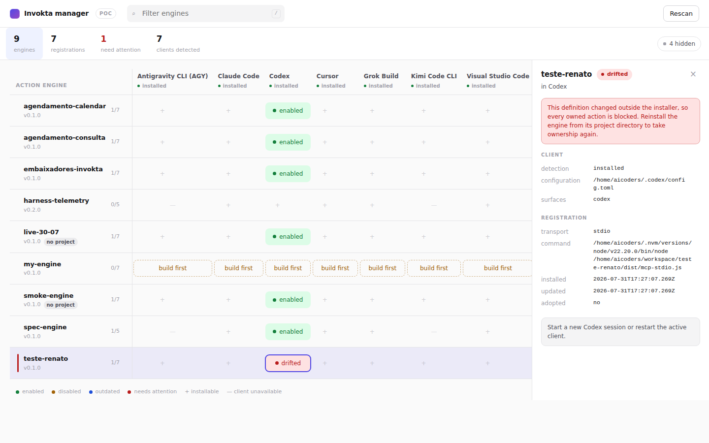
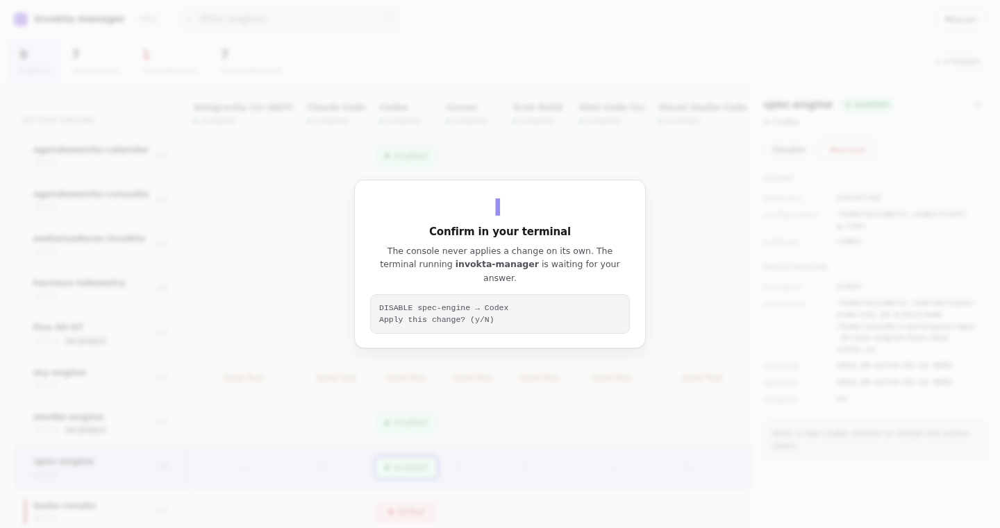

# `invokta-manager` — proof of concept

A local web console for the Action Engines installed on this machine. It answers
three questions the current tooling cannot answer in one place:

1. **Which engines exist here?** — engines registered by the installer, plus
   engine projects found on disk through their `invokta.mcp.json` manifest.
2. **Where is each one installed?** — one column per supported MCP client, with
   the live ownership status of every registration.
3. **Where could it be installed?** — every empty cell that is actually
   eligible, which turns "install" into a click instead of a command.

This is a proof of concept on a throwaway branch. It is **not** a package, it is
not published, it is not in the workspace list, and it is not referenced by the
root TypeScript project. `yarn check` is unaffected.



## The interface

The matrix is the whole product, so everything else stays out of its way.

- **Rows** are engines, **columns** are clients, **cells** are registrations. A
  cell carries its ownership status; an empty eligible cell is the install
  gesture; an unreachable client is a dash at 30% opacity.
- **Clients that nobody can install into are hidden by default** — blocked
  targets and clients with neither an executable nor a configuration file. The
  `n hidden` chip brings them back. On this machine that turns eleven columns
  into seven that fit without scrolling.
- **The counters filter.** `need attention` jumps straight to the engines whose
  registrations drifted or conflict; those rows also carry a red edge marker.
- **The side panel appears only when something is selected**, so the matrix owns
  the full width while you scan. A row selection acts on every client at once; a
  cell selection acts on one registration.
- **Selection lives in the URL fragment**, so a specific registration is
  linkable and survives a reload.
- `/` focuses the filter, `Escape` clears the selection, and paths are
  click-to-copy.

Every mutation raises a blocking overlay that points at the terminal and echoes
the exact change being confirmed there:



## Running it

```bash
yarn build                                   # the console reads the built installer
node apps/manager-poc/bin/invokta-manager.mjs
```

Options:

| Option | Effect |
| --- | --- |
| `--scan <directory>` | Add a directory to the project scan. Repeatable. |
| `--port <number>` | Use a fixed loopback port instead of an ephemeral one. |
| `--no-open` | Print the URL instead of opening a browser. |

Without `--scan`, the console scans the working directory plus the conventional
`~/workspace`, `~/projects`, `~/code`, `~/dev`, `~/src`, and `~/repos` roots,
four levels deep, skipping hidden and dependency directories.

The process needs an interactive terminal, because that is where changes are
confirmed. Press `Ctrl+C` to stop it.

## Testing the write path safely

Browsing the real machine is read-only, but install, enable, disable, and remove
edit real client configuration. To exercise them against fixtures instead:

```bash
apps/manager-poc/scripts/sandbox.sh
```

That builds a throwaway `HOME` with a Cursor, VS Code, and Codex configuration —
each containing an unrelated server, so byte preservation is observable — plus
one `demo-engine` project, and runs the console against it. The sandbox path is
printed on start; delete the directory when you are done.

## The one architectural decision this validates

**The browser proposes; the terminal authorizes.**

ADR 0010 and ADR 0013 make an explicit TTY confirmation the authorization
boundary for every configuration write, and ADR 0010 states that the installer
has no public programmatic mutation API. A web UI could easily erode that: a
page bound to `127.0.0.1` is still reachable by any local process, any browser
tab, and any DNS-rebinding or cross-site attempt.

So this console never authorizes anything. Clicking `Disable` sends a proposal
to the local process, which prints the exact change in the terminal and waits:

```text
▌ DISABLE  spec-engine
▌ Clients: Codex
▌ Command: /home/me/.nvm/versions/node/v22.20.0/bin/node /home/me/work/spec-engine/dist/mcp-stdio.js
▌ Requested from the console at 2026-08-01T22:14:03.118Z
▌
▌ Apply this change? (y/N)
```

Only after `y` does the mutation run, through the installer's own transaction
coordinator: shared state lock, target lock, revalidation, atomic configuration
commit, atomic state commit, rollback on failure. The console adds no write path
of its own.

The HTTP surface is loopback-only, requires a 256-bit session token on every
request, validates `Host` and `Origin`, sends no CORS headers, serves exactly
one page, and applies a restrictive CSP.

## What the proof of concept exercises

Verified in an isolated `HOME` against a fixture client configuration:

| Flow | Result |
| --- | --- |
| `install` into an eligible client | writes the definition, unrelated servers byte-preserved |
| `disable` | detaches the owned definition, keeps the state record |
| `enable` | restores the exact suspended definition |
| `remove` | deletes the definition and the state record |
| declining in the terminal | zero writes, zero state change |
| wrong token / missing token / foreign origin | `403` |

Against the real machine it renders 9 engines across 11 configuration targets,
including `drifted` (changed outside the installer, every action correctly
blocked), `state only` (installed, but the project no longer exists on disk),
and `build first` (a project whose entry point has not been compiled yet).

## Gaps this surfaced in `@invokta/installer`

The console needed four things the installer does not expose today. These are
the real deliverables hiding behind "make management easier":

1. **A machine-readable inventory.** `status` prints for humans only. The
   console wants the same data as JSON, including per-target ownership status.
2. **Scoped management commands.** `enable`, `disable`, and `remove` always
   present an interactive picker over every installation. There is no way to say
   "disable *this* engine in *this* client".
3. **Scoped installation.** `install --engine <dir>` chooses clients through an
   interactive multiselect, so a caller cannot request a specific set.
4. **An eligibility view.** Nothing reports where an engine *could* be
   installed. The console computes it from the target catalog, each adapter's
   compatibility function, and the detection snapshot.

## How this cheats, and what productization would cost

`src/installer-bridge.mjs` imports the installer's **built internal modules by
path**. That is deliberate and it is the only questionable file in the POC: the
installer declares `"exports": {}` and forbids `node:http` in its own package
boundary test, so a real manager cannot import it and cannot host a server
inside it. Everything the bridge touches is exactly the surface a real
implementation needs, which is why it is isolated in one file.

Two candidate shapes, in preference order:

**A. Separate package, installer CLI as the only contract.** `@invokta/manager`
owns the HTTP server and the UI. It reads through a new
`invokta-installer status --json` and mutates by spawning
`invokta-installer disable --engine <id> --target <target>` with inherited
stdio, so the installer itself owns the terminal and prints its own
confirmation. ADR 0010 survives untouched: no programmatic API, no network code
in the installer, the confirmation stays where it already is. The additive work
is CLI grammar plus a JSON reporter.

**B. Separate package, exported read-only inspection API.** The installer adds a
narrow `@invokta/installer/inventory` export for detection and ownership
inspection, and keeps mutation CLI-only. Faster and better typed than parsing
JSON, but it opens an import surface the installer has so far refused.

Either way the console does not belong inside `@invokta/installer`. The `npx`
entry point the idea started from is a separate published package.

## Deliberately out of scope here

- MCP servers that Invokta does not manage. Showing every server in every client
  would make the console the obvious place to manage all of them; that is a
  product decision, not a technical one.
- Project, profile, and workspace configuration scopes. The installer owns
  user-scope configuration only.
- Windows configuration mutation, which the installer does not support.
- Installing a remote HTTP engine. `install --http` exists in the installer and
  would be a second form in the UI; the local-engine flow was enough to validate
  the interaction model.
- Any test suite. This branch is for a decision, not for merging.
