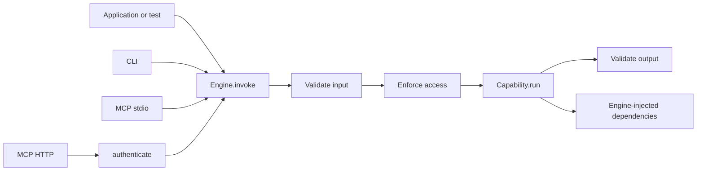

# Architecture and contracts

## Single hexagon

**AE-ARCH-01 — Direction.** The core MUST NOT import the CLI, MCP, HTTP, a model
SDK, or an identity SDK. Adapters import only the core's public API. Capabilities
MAY import interfaces and rules from the custom engine.

**AE-ARCH-02 — Simple injection.** Repository, model, data, and tool interfaces
belong to the custom engine. Implementations enter through a factory or closure
at the composition root. The framework MUST NOT register ports or provide a
service container, lifecycle, or formal modules.

**AE-ARCH-03 — Single path.** No adapter MAY call `run` directly. All adapters use
`engine.invoke`. Authentication produces a `Principal`; authorization remains
inside `invoke`.

## Normative pipeline

**AE-PIPE-01 — Order.** `engine.invoke` MUST:

1. generate or accept a `requestId`;
2. resolve the capability by ID;
3. validate and transform the input;
4. create the `ExecutionContext` and enforce `access`;
5. combine the received `AbortSignal` with `timeoutMs`, execute `run`, and validate
   the output;
6. emit success or failure and return the typed data or throw an `EngineError`.

This pipeline has no port registry, concurrency slot, queue,
before/after/onError policies, obligations, retry, fallback, cache, or model
routing. Those decisions belong to the capability or its injected dependencies.

Input and output validation includes checking the value produced by the Standard
Schema transformation against the lossless JSON data model in ADR 0002. A value
outside that model fails in the same validation stage, before `access` for input
or before return for output. The corresponding code is `INPUT_INVALID` or
`OUTPUT_INVALID`; public details identify the contract failure without including
the rejected value. A successful input transformation is deep-snapshotted for
the request before authorization. `access` receives an independent clone and
`run` receives the request-owned execution snapshot, so neither caller mutation
nor authorization mutation changes the data that execution observes.

`createEngine` is also the capability-contract boundary. It MUST capture every
top-level capability field exactly once at construction so later replacement or
changing accessors for `input`, `output`, `access`, `run`, metadata, annotations,
or timeout configuration cannot create a split registered contract. The same
captured `timeoutMs` value is validated, described, and used for execution.
Standard JSON Schema converters run synchronously during construction. Their
documents MUST be object-rooted lossless JSON, copied away from converter-owned
objects, and deeply frozen internally. Cyclic, proxy-backed, accessor-backed, or
otherwise non-JSON documents fail construction synchronously. `list` and
`describe` return
fresh, deeply frozen snapshots, preventing a caller or adapter request from
changing later runtime or MCP contracts. Standard Schema validation itself
continues to run only at invocation through the captured input and output schema
objects.

When present, `timeoutMs` MUST be an integer from `1` through `2_147_483_647`,
inclusive. `createEngine` validates this limit synchronously. Zero, negative or
fractional values, non-finite numbers, and values above the limit fail
construction with `TypeError`; they never reach the host timer implementation.

## Errors

**AE-ERR-01 — Taxonomy.** `EngineError` MUST use one of these codes:

- `CAPABILITY_NOT_FOUND`;
- `INPUT_INVALID`;
- `UNAUTHENTICATED`;
- `FORBIDDEN`;
- `OUTPUT_INVALID`;
- `CANCELLED`;
- `EXECUTION_FAILED`.

Unknown errors become `EXECUTION_FAILED`. Only `publicDetails` may be serialized;
`cause` and the stack remain internal. Cancellation or a timeout observed by the
runtime becomes `CANCELLED`. A thrown `EngineError` is preserved only when its
own `code` and `message` data properties form a stable public error. A proxy,
accessor-backed property, missing message, or code outside the seven-code
taxonomy is treated as an unknown error without invoking the unsafe property.

Reading `requestId` and `source` from invocation options is part of this error
boundary. If either property access throws, the runtime discards all partially
read option metadata, uses a generated request ID and the default `direct`
source, emits the ordered started and failed events, and throws a normalized
`EXECUTION_FAILED` error. The property failure remains internal as the cause.
Failures while reading or snapshotting `principal` are a distinct identity
boundary and always produce a sanitized `UNAUTHENTICATED` error. Failures while
reading `signal` or setting up caller-signal state always produce a sanitized
`EXECUTION_FAILED` error. An `EngineError` thrown by either caller-controlled
boundary cannot select its public code, message, or details. `InvokeOptions.signal`
must be a platform-branded `AbortSignal` from the supported runtime. The runtime
rejects proxies without invoking their traps, then checks the platform brand with
a captured intrinsic before it invokes any signal method. Structural, polyfilled,
or proxy substitutes fail as `EXECUTION_FAILED` without executing their accessors,
traps, or listener methods. Captured platform intrinsics also bypass hostile
own-property overrides. Authorization receives a runtime-owned, no-timeout signal
view, while execution retains the caller signal identity when no timeout is
configured. The capability timeout still starts only after authorization
completes.

## Events

**AE-OBS-01 — Single hook.** The only cross-cutting hook is `onEvent`,
with the events `invocation.started`, `invocation.completed`, and
`invocation.failed`. The started event contains `requestId`, `capabilityId`,
`source`, optional `principalId`, and ISO `startedAt`. The completed event contains
`requestId`, `capabilityId`, and `durationMs`. The failed event contains those
identifiers, `durationMs`, and an `EngineErrorCode`. Payloads, tokens, and
credentials are not included by default. A rejected or thrown `onEvent` hook
MUST NOT change the invocation result; the runtime MAY send a payload-free
diagnostic to the configured logger. The runtime invokes the started hook and
then exactly one terminal hook synchronously in pipeline order, but it observes
any promise returned by a hook without awaiting it. Event delivery is therefore
best-effort: a pending hook cannot block execution or result delivery, and the
framework provides no delivery-completion guarantee. Rejections from the hook and from an
asynchronous diagnostic logger are contained without producing an unhandled
rejection. After successful output validation, the runtime MUST clear its
capability timeout before invoking the completed hook.

## CLI

**AE-CLI-01 — Commands.** `@invokta/cli` MUST implement `list`, `describe`, and
`run`, accept JSON through `--input` or stdin, and receive the local principal
through the composition root. It MUST NOT provide an actor, role, or login flag.

**AE-CLI-02 — I/O.** `stdout` contains only the requested result; logs and
diagnostics go to `stderr`. The exit code is `0` for success, `1` for an execution
or authorization failure, and `2` for invalid usage or JSON. `runCli` returns the
exit code and does not terminate the process or mutate `process.exitCode`; the
composition root owns that process-level decision. Errors are compact JSON with
only `code`, `message`, and optional `publicDetails`. JSON is the default output
format; trusted configuration may select deterministic, pretty-printed JSON as
the human rendering of the same result. Invokta does not impose a stdin size
limit; hosts that accept untrusted local input must bound the stream before it
reaches the adapter.

The default stdin reader MUST decode byte chunks incrementally with fatal UTF-8
validation. It MUST preserve a valid multibyte code point split across byte
chunks and a surrogate pair split across string chunks. Malformed UTF-8 produces
an `INVALID_USAGE` diagnostic and exit code `2` without calling `engine.invoke`.

`CliIo.writeStdout` and `CliIo.writeStderr` accept either `void` or
`Promise<void>`, and `runCli` MUST await both kinds of writer. A stdout writer
that throws or rejects produces the sanitized `EXECUTION_FAILED` diagnostic and
exit code `1`. A stderr writer that throws or rejects is contained; it MUST NOT
create an unhandled rejection or prevent `runCli` from resolving the numeric code
selected for the original outcome.

## MCP

**AE-MCP-01 — One capability, one tool.** Key, title, description, schemas, and
annotations map directly to the tool. Success returns `structuredContent` and a
JSON text fallback. A nonexistent tool is a protocol error; all other capability
errors return `isError: true`. Error serialization is atomic: if the adapter
cannot safely read or serialize the structured `EngineError`, it MUST return the
generic `EXECUTION_FAILED` tool error and MUST NOT let the SDK convert the failure
into an internal protocol error.

**AE-MCP-02 — Isolated SDK.** `@invokta/mcp` encapsulates the official SDK and
MUST NOT leak its types through the public API or copy it into the core. The
baseline revision is `2025-11-25`; the approved version is recorded in ADR 0006
and the lockfile. Valid request IDs retain their protocol identity, including
numeric zero and the empty string, and cancellation MUST reach only the request
identified by the notification.

**AE-MCP-03 — stdio.** `stdout` is reserved exclusively for the protocol; logs go
to `stderr`. The trusted local principal is configured by the host. The signal
provided by the SDK MUST be propagated to `context.signal`. The stdio server owns
the protocol connection lifetime: stdin end or close MUST idempotently close the
transport, abort active request signals, and remove its stream listeners. A
broken stdout pipe is a normal client disconnect and MUST be contained without an
uncaught error or diagnostic on protocol stdout. On
POSIX, where Node performs pipe writes asynchronously, channel teardown MUST
discard and settle pending protocol writes before error containment is removed,
so a backpressured or late-failing write cannot keep the process alive or escape
as an uncaught stream error.

The stdio read buffer defaults to 10,485,760 bytes. A host MAY configure
`maxReadBufferBytes` to another positive safe integer. A buffer append that keeps
the total at or below the configured boundary is accepted. An append that would
cross the boundary closes the protocol connection, aborts active request
signals, removes the adapter's process-stream listeners, and rejects
`serveMcpStdio` with a payload-free error. An invalid limit rejects before the
transport installs process-stream listeners.

[Node performs pipe writes synchronously on Windows](https://nodejs.org/api/process.html#a-note-on-process-io).
Normal stdio protocol exchanges remain supported there, but a peer that stops
draining stdout can block JavaScript before EOF handlers run. Windows
integrations MUST continuously drain server stdout and MUST provide process
supervision capable of terminating a stalled process. The adapter does not claim
interruptible teardown for a non-reading Windows peer.

**AE-MCP-04 — Stateless HTTP.** The sole endpoint is `/mcp`; each request is
independent. The default bind address is `127.0.0.1`. `Host` and `Origin` MUST be
validated. Unauthenticated mode requires an explicit development option whose
name communicates the risk.

The protocol endpoint accepts only `POST`. Each accepted POST creates a new MCP
server and a new transport with sessions, resumption, event storage, and
server-to-client SSE disabled. When OAuth Protected Resource Metadata is
configured, its public well-known GET route is the only non-protocol route.
Only the exact, canonical `/mcp` request target reaches protocol dispatch; dot
segments, percent encoding, a query, a fragment, and absolute-form targets are
rejected. The `2025-11-25` profile accepts exactly one top-level JSON-RPC message
and rejects every top-level array before SDK dispatch. `Accept` must contain the
exact `application/json` and `text/event-stream` media ranges with positive
quality. After successful authentication, exactly one raw `Content-Type` header
is required and it must identify the exact `application/json` media type;
missing, duplicated, or invalid values return HTTP 415.
`Host` is validated for every request before authentication. An `Origin` header
is optional, but any supplied origin requires an explicit exact allowlist.
Boundary failures for `Host` or `Origin` return HTTP 403. A capability-level
`FORBIDDEN` remains an MCP tool execution error over HTTP 200.

After Host, Origin, and canonical route validation, an invalid method or a
declared body overflow is rejected before the authentication hook. Any response
that terminates without consuming the request body advertises connection closure,
drains available data, and closes an incomplete request after flushing the
response. Body reading checks the aborted and destroyed state both before and
after listener installation so a disconnect race always settles.

Exactly one raw `Host` header is required, an IPv6 authority must use brackets,
and forwarded-host headers are ignored.
The authentication hook receives only the normalized path, method, cancellation
signal, and a read-only header view with `get` and `has`. Request bodies default
to a 1,048,576-byte limit. A host may configure `maxRequestBodyBytes` to another
positive safe integer. Both an oversized `Content-Length` and a body that crosses
the limit while streaming return HTTP 413 before protocol dispatch.

An authenticator returns a `Principal` for valid credentials or `null` for
missing or invalid credentials; `null` produces HTTP 401. A thrown authenticator
error is treated as an infrastructure failure and produces a sanitized HTTP 500.
The adapter validates and snapshots the authentication mode and hook before it
listens. After each successful hook call, it deep-clones and validates the
request's `Principal`; the ID must be a nonempty string and optional attributes
must be a record. Malformed, non-cloneable, or subsequently mutated identities
cannot reach `invoke`. More than one raw `Authorization` header is rejected
before authentication.
Request bodies are decoded incrementally as strict UTF-8 while enforcing the byte
limit. An incomplete, overlong, or otherwise malformed byte sequence produces a
sanitized HTTP 400 JSON-RPC parse error before SDK dispatch or `invoke`; valid
multibyte sequences may span incoming chunks.
The adapter propagates cancellation when the active HTTP request disconnects.
Cross-request MCP cancellation is not promised by the stateless profile because
no transport or session survives between requests.

Protected Resource Metadata requires an HTTP(S) resource whose path is exactly
`/mcp`, without credentials, query, or fragment. HTTPS is mandatory except for an
explicit loopback HTTP development resource. At least one authorization server
is required; each authorization server uses HTTPS without credentials, query, or
fragment. Authorization-server paths are allowed because OAuth issuer identifiers
may use path components.

## Authentication and authorization

**AE-SEC-01 — Hybrid model.** The core contains `Principal` and `AccessRule`, and
enforces the access rule. MCP HTTP receives an `authenticate` hook. The custom
engine decides domain authorization and may call any PDP through a function.

**AE-SEC-02 — Boundaries.** Identity never comes from the input. When HTTP
authentication is required, a missing or failed identity produces a 401 before
`invoke` and, when configured, a challenge/Protected Resource Metadata. An
authenticated but unauthorized principal produces `FORBIDDEN` and does not call
`run`. A non-null principal passed to `invoke` must be a structured-cloneable
record with a non-empty string `id`; when present, `attributes` must be a
structured-cloneable record. The core snapshots it before asynchronous work and
gives `access` and `run` independent copies. Malformed or uncloneable identity is
`UNAUTHENTICATED` and reaches neither stage.

The framework does not issue tokens, perform login, store users, validate JWTs
from a specific provider, or implement an Authorization Server/policy engine.

## MCP client installation

**AE-INSTALL-01 — Static sources.** `@invokta/installer` MAY configure a
reviewed bundled descriptor, an explicitly selected project-local
`invokta.mcp.json` manifest, or an explicitly supplied canonical Streamable HTTP
URL. It MUST NOT discover remote servers, download or load packages, reflect on
or execute an engine, start a transport, call a capability, or open a network
connection. Local manifests and persisted state contain environment variable
names but no environment values or credentials.

**AE-INSTALL-02 — Confirmed user scope.** Installation targets only the finite
catalog of supported default user configurations. All compatible eligible
targets are preselected, but no mutation occurs without explicit confirmation.
Engine-scoped removal preflights every matching managed target and one
confirmation authorizes its complete ordered removable set.
Creating a missing configuration requires installed-client evidence. Project,
profile, remote-workspace, organization-managed, and Windows configuration
mutation are not provided by this profile.

**AE-INSTALL-03 — Managed lifecycle.** New ownership records persist the
normalized launch descriptor. `status`, `enable`, `disable`, and `remove`
re-inspect current configuration and fail closed on conflicts, drift, an unsafe
path, or unavailable legacy metadata. Status and enablement report or fail on a
missing runtime when execution would require it. Removal does not require the
engine runtime: it deletes only a definition whose persisted managed identity
and ownership evidence still match, then removes its ownership record. The
engine-scoped overload applies that rule independently to every state record
selected by one validated manifest ID.

**AE-INSTALL-04 — Per-target transaction.** Each client mutation acquires the
shared state lock before its configuration lock, revalidates after locking,
commits same-directory atomic configuration and state post-images, and restores
the exact configuration pre-image if state commit fails. Multi-client operations
are ordered independent transactions, report partial results, and become
idempotent when repeated.

**AE-INSTALL-05 — Execution boundary.** A generated local launch descriptor
uses the current absolute Node executable and the validated absolute compiled
entry point. The configured MCP adapter continues to call only
`engine.invoke`; installer operations never enter the capability execution
path.

## Engine project creation

**AE-CREATE-PROFILE-01..03 — Interaction and authorization.**
`create-invokta-engine` accepts an optional relative target and one of the
closed profiles `complete`, `mcp-stdio`, `mcp-http`, or `cli`. Without `--yes`,
it is interactive only when standard input and standard error are both TTYs.
It prompts for missing location and profile decisions, builds and preflights the
complete immutable plan, and requires one final confirmation before mutation.
The confirmation names only the normalized relative target, profile,
package-manager choice, and installation behavior. Non-terminal execution never
prompts: an explicit target uses the explicit profile or `complete`, while a
missing target is `INTERACTIVE_REQUIRED`. `--yes` requires a target and skips
all prompts.

**AE-CREATE-PROFILE-04..07 — Profile and execution boundaries.** Every profile
contains the engine, capability, direct entry point, test, instructions, and
development skill. `complete` adds CLI, MCP stdio, and MCP HTTP; each focused
profile adds exactly its named adapter. Dependencies, scripts, manifests, and
documentation are the exact set union for those generated channels. Every
entry point imports the shared engine and executes only through `engine.invoke`
or an official adapter that uses it.

MCP HTTP bytes remain owned by `@invokta/deploy`. Its public
`@invokta/deploy/scaffold` subpath exposes the pure
`createMcpHttpScaffoldFiles` planner and `starterDeployManifest`. The planner
returns immutable, lexicographically ordered project-relative text entries and
performs no filesystem, process, network, engine, or capability operation. The
creator merges that complete plan before any write and never invokes the deploy
CLI or imports an internal deploy path.

**AE-CREATE-PROFILE-08..11 — Limits and transaction.** One prompt answer is a
strict UTF-8 line of at most 4,096 encoded bytes including its terminator. A
limit or decoding violation, or three invalid answers to one question, is
`PROMPT_INVALID`; EOF, interruption, or prompt I/O failure is
`PROMPT_ABORTED`. A negative confirmation returns success and has no side
effect. Prompt diagnostics never echo rejected data.

Planning performs no mutation or process execution. After confirmation, target
state is revalidated through the existing no-follow, empty-target, exclusive
creation, deterministic-byte, and rollback boundary. At most one shell-free
package-manager install starts, only after the selected scaffold is complete.
`--no-install`, cancellation, and prompt failure start no process or network
operation. Generated documentation and agent guidance name exactly the selected
channels and cannot advertise an omitted adapter.

**AE-CREATE-PROFILE-12 — Evolution.** The `complete` profile is the release
conformance fixture for direct, CLI, MCP stdio, and MCP HTTP reuse. Focused
profiles are bounded bootstrap projects rather than a weakening of the reuse or
single-invocation-path invariants. Adding another profile, prompt decision,
template authority, or in-place conversion requires another architectural
decision.
