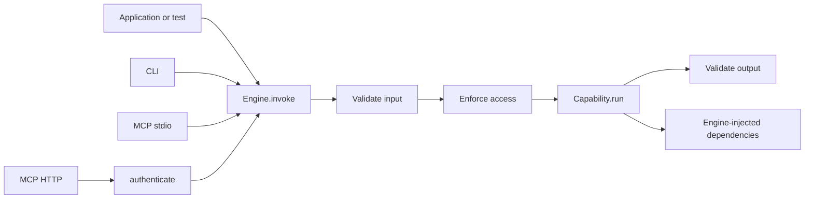

# Architecture and contracts

## Single hexagon

**AE-ARCH-01 — Direction.** The core MUST NOT import the CLI, MCP, HTTP, a model
SDK, or an identity SDK. Adapters import only the core's public API. Capabilities
MAY import interfaces and rules from the custom engine.

**AE-ARCH-02 — Simple injection.** Repository, model, data, and tool interfaces
belong to the custom engine. Implementations enter through a factory or closure
at the composition root. The framework MUST NOT register ports or provide a
service container, lifecycle, or formal modules.

**AE-ARCH-03 — Single path.** No adapter MAY call `run` directly. All adapters use
`engine.invoke`. Authentication produces a `Principal`; authorization remains
inside `invoke`.

## Normative pipeline

**AE-PIPE-01 — Order.** `engine.invoke` MUST:

1. generate or accept a `requestId`;
2. resolve the capability by ID;
3. validate and transform the input;
4. create the `ExecutionContext` and enforce `access`;
5. combine the received `AbortSignal` with `timeoutMs`, execute `run`, and validate
   the output;
6. emit success or failure and return the typed data or throw an `EngineError`.

This pipeline has no port registry, concurrency slot, queue,
before/after/onError policies, obligations, retry, fallback, cache, or model
routing. Those decisions belong to the capability or its injected dependencies.

## Errors

**AE-ERR-01 — Taxonomy.** `EngineError` MUST use one of these codes:

- `CAPABILITY_NOT_FOUND`;
- `INPUT_INVALID`;
- `UNAUTHENTICATED`;
- `FORBIDDEN`;
- `OUTPUT_INVALID`;
- `CANCELLED`;
- `EXECUTION_FAILED`.

Unknown errors become `EXECUTION_FAILED`. Only `publicDetails` may be serialized;
`cause` and the stack remain internal. Cancellation or a timeout observed by the
runtime becomes `CANCELLED`.

## Events

**AE-OBS-01 — Single hook.** The only cross-cutting hook in v0.1 is `onEvent`,
with the events `invocation.started`, `invocation.completed`, and
`invocation.failed`. Events contain only
request/capability/source/principalId/timestamp/duration/code as applicable to
their type. Payloads, tokens, and credentials are not included by default.

## CLI

**AE-CLI-01 — Commands.** `@ai-engine/cli` MUST implement `list`, `describe`, and
`run`, accept JSON through `--input` or stdin, and receive the local principal
through the composition root. It MUST NOT provide an actor, role, or login flag.

**AE-CLI-02 — I/O.** `stdout` contains only the requested result; logs and
diagnostics go to `stderr`. The exit code is `0` for success, `1` for an execution
or authorization failure, and `2` for invalid usage or JSON.

## MCP

**AE-MCP-01 — One capability, one tool.** Key, title, description, schemas, and
annotations map directly to the tool. Success returns `structuredContent` and a
JSON text fallback. A nonexistent tool is a protocol error; all other capability
errors return `isError: true`.

**AE-MCP-02 — Isolated SDK.** `@ai-engine/mcp` encapsulates the official SDK and
MUST NOT leak its types through the public API or copy it into the core. The
baseline revision is `2025-11-25`; the approved version is recorded in ADR 0006
and the lockfile.

**AE-MCP-03 — stdio.** `stdout` is reserved exclusively for the protocol; logs go
to `stderr`. The trusted local principal is configured by the host. The signal
provided by the SDK MUST be propagated to `context.signal`.

**AE-MCP-04 — Stateless HTTP.** The sole endpoint is `/mcp`; each request is
independent. The default bind address is `127.0.0.1`. `Host` and `Origin` MUST be
validated. Unauthenticated mode requires an explicit development option whose
name communicates the risk.

## Authentication and authorization

**AE-SEC-01 — Hybrid model.** The core contains `Principal` and `AccessRule`, and
enforces the access rule. MCP HTTP receives an `authenticate` hook. The custom
engine decides domain authorization and may call any PDP through a function.

**AE-SEC-02 — Boundaries.** Identity never comes from the input. When HTTP
authentication is required, a missing or failed identity produces a 401 before
`invoke` and, when configured, a challenge/Protected Resource Metadata. An
authenticated but unauthorized principal produces `FORBIDDEN` and does not call
`run`.

The framework does not issue tokens, perform login, store users, validate JWTs
from a specific provider, or implement an Authorization Server/policy engine.
