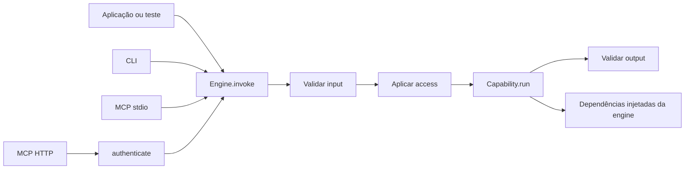

# Arquitetura e contratos

## Hexágono único

**AE-ARCH-01 — Direção.** Core NÃO DEVE importar CLI, MCP, HTTP, SDK de modelo ou
SDK de identidade. Adapters importam somente a API pública do core. Capabilities
PODEM importar interfaces e regras da engine customizada.

**AE-ARCH-02 — Injeção simples.** Interfaces de repositório, modelo, dados e
ferramentas pertencem à engine customizada. Implementações entram por factory ou
closure no composition root. O framework NÃO DEVE registrar ports, oferecer
service container, lifecycle ou modules formais.

**AE-ARCH-03 — Caminho único.** Nenhum adapter PODE chamar `run` diretamente.
Todos usam `engine.invoke`. Autenticação produz `Principal`; autorização continua
dentro de `invoke`.

## Pipeline normativo

**AE-PIPE-01 — Ordem.** `engine.invoke` DEVE:

1. gerar ou aceitar `requestId`;
2. resolver a capability pelo ID;
3. validar e transformar o input;
4. criar `ExecutionContext` e aplicar `access`;
5. combinar o `AbortSignal` recebido com `timeoutMs`, executar `run` e validar o
   output;
6. emitir sucesso ou falha e retornar o dado tipado ou lançar `EngineError`.

Não existem nesse pipeline registry de ports, slot de concorrência, fila,
policies before/after/onError, obligations, retry, fallback, cache ou model
routing. Essas decisões pertencem à capability ou às dependências injetadas.

## Erros

**AE-ERR-01 — Taxonomia.** `EngineError` DEVE usar um dos códigos:

- `CAPABILITY_NOT_FOUND`;
- `INPUT_INVALID`;
- `UNAUTHENTICATED`;
- `FORBIDDEN`;
- `OUTPUT_INVALID`;
- `CANCELLED`;
- `EXECUTION_FAILED`.

Erros desconhecidos viram `EXECUTION_FAILED`. Somente `publicDetails` pode ser
serializado; `cause` e stack ficam internos. Cancelamento ou timeout observado
pelo runtime vira `CANCELLED`.

## Eventos

**AE-OBS-01 — Hook único.** O único hook transversal da v0.1 é `onEvent`, com os
eventos `invocation.started`, `invocation.completed` e `invocation.failed`.
Eventos contêm somente request/capability/source/principalId/instante/duração/código
conforme seu tipo. Payloads, tokens e credentials NÃO entram por default.

## CLI

**AE-CLI-01 — Comandos.** `@ai-engine/cli` DEVE implementar `list`, `describe` e
`run`, aceitar JSON por `--input` ou stdin, e receber o principal local pelo
composition root. NÃO DEVE oferecer flag de actor, role ou login.

**AE-CLI-02 — I/O.** `stdout` contém somente o resultado solicitado; logs e
diagnósticos vão para `stderr`. Exit code é `0` para sucesso, `1` para falha de
execução/autorização e `2` para uso ou JSON inválido.

## MCP

**AE-MCP-01 — Uma capability, uma tool.** Chave, title, description, schemas e
annotations mapeiam diretamente para a tool. Sucesso retorna `structuredContent`
e fallback textual JSON. Tool inexistente é erro de protocolo; demais erros de
capability retornam `isError: true`.

**AE-MCP-02 — SDK isolado.** `@ai-engine/mcp` encapsula o SDK oficial e NÃO DEVE
vazar seus tipos pela API pública nem copiá-lo no core. A revisão baseline é
`2025-11-25`; a versão aprovada está no ADR 0006 e no lockfile.

**AE-MCP-03 — stdio.** `stdout` é exclusivo do protocolo; logs vão para `stderr`.
O principal local confiável é configurado pelo host. O sinal entregue pelo SDK
DEVE ser propagado a `context.signal`.

**AE-MCP-04 — HTTP stateless.** O endpoint único é `/mcp`; cada request é
independente. O bind padrão é `127.0.0.1`. `Host` e `Origin` DEVEM ser validados.
Modo sem autenticação exige opção explícita de desenvolvimento com nome de risco.

## Autenticação e autorização

**AE-SEC-01 — Modelo híbrido.** O core contém `Principal`, `AccessRule` e seu
enforcement. MCP HTTP recebe hook `authenticate`. A engine customizada decide
autorização de domínio, podendo chamar qualquer PDP por função.

**AE-SEC-02 — Fronteiras.** Identidade nunca vem do input. Quando auth HTTP é
obrigatória, ausência ou falha de identidade gera 401 antes de `invoke` e, quando
configurado, challenge/Protected Resource Metadata. Principal autenticado mas não
autorizado gera `FORBIDDEN` e não chama `run`.

O framework NÃO emite tokens, faz login, armazena usuários, valida JWT de um
fornecedor específico ou implementa Authorization Server/policy engine.
