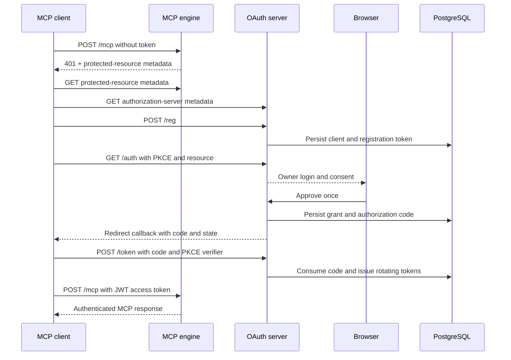

# OAuth Architecture

## Purpose

The project owns both the MCP resource server and its OAuth authorization
server. No external identity provider is required. PostgreSQL is the shared
security boundary for the owner account, signing material, registered clients,
grants, sessions, authorization codes, access tokens, and refresh tokens.

## Components

| Component | Responsibility |
| --- | --- |
| `src/mcp-http.ts` | Serve MCP Streamable HTTP through `engine.invoke` |
| `src/http-auth.ts` | Verify JWT signature, issuer, audience, subject, and scope |
| `src/oauth-server.ts` | Host OAuth routes and sanitized request diagnostics |
| `src/oauth/provider.ts` | Configure oidc-provider, DCR, PKCE, grants, and token policy |
| `src/oauth/interaction-server.ts` | Render login and consent with CSRF protection |
| `src/oauth/user-store.ts` | Create and authenticate the single owner |
| `src/oauth/postgres-adapter.ts` | Persist oidc-provider artifacts |
| `src/oauth/secrets.ts` | Generate and persist cookie keys and ES256 signing keys |
| `migrations/001_oauth.sql` | Create the OAuth persistence boundary |

## Request flow



## Public routing

The edge proxy sends only these routes to the engine:

- `/mcp`
- `/.well-known/oauth-protected-resource/mcp`

It sends discovery, JWKS, registration, authorization, interaction, token,
revocation, and registration-management routes to the OAuth service. The MCP
router must have higher priority than the catch-all OAuth router.

## Client registration

Dynamic Client Registration is enabled without an initial access token. When a
client omits metadata, the server defaults to:

```json
{
  "grant_types": ["authorization_code", "refresh_token"],
  "response_types": ["code"],
  "id_token_signed_response_alg": "ES256",
  "token_endpoint_auth_method": "client_secret_basic"
}
```

Clients may explicitly register `client_secret_post`, which is required by
some hosted MCP clients. Registration access tokens permit the client to read,
update, or delete only its own registration.

Client ID Metadata Documents are disabled. Supporting CIMD safely requires a
metadata fetch policy that defends against private and link-local addresses,
DNS rebinding and re-resolution, redirects, oversized responses, and timeouts.
The example uses DCR until its Authorization Server library exposes that
reviewable boundary.

## Authorization and consent

- The authorization code lifetime is 60 seconds.
- S256 PKCE is mandatory for every client.
- The browser authenticates the only owner account.
- Consent grants OIDC scopes and resource-specific `mcp:tools` access.
- CSRF tokens are HMAC-bound to the interaction ID.
- A consumed or expired interaction cannot be submitted again.
- The consent CSP permits an HTTPS callback redirect chain or an exact HTTP
  loopback callback. It continues to reject unsafe schemes and external HTTP.

## Tokens

| Token | Policy |
| --- | --- |
| Access token | ES256 JWT, 10 minutes, exact MCP audience, `mcp:tools` |
| Authorization code | 60 seconds, bound to client, redirect URI, and PKCE |
| Refresh token | 30 days, rotated on use |
| Browser session | 12 hours |
| Grant | 30 days |

The resource server verifies the JWT against the OAuth JWKS. Any verification,
metadata, or key-fetch failure returns no principal and therefore fails closed.

## Persistence

| Table | Contents |
| --- | --- |
| `oauth_users` | Owner email, password hash, lockout state |
| `oauth_settings` | Cookie keys and private signing JWKS |
| `oauth_artifacts` | Clients, grants, sessions, codes, and tokens |

Back up and restore all three tables together. Restoring domain data without
the OAuth signing keys invalidates sessions and tokens; restoring keys without
the matching accounts and grants creates an inconsistent authorization state.

## Diagnostics

OAuth request diagnostics record only:

- HTTP method;
- normalized route stage;
- status;
- redirect origin;
- sanitized error code.

They never record URL query values, interaction IDs, submitted metadata,
passwords, cookies, client secrets, registration tokens, authorization codes,
PKCE values, access tokens, or refresh tokens.

## Change checklist

Before changing OAuth behavior:

1. Identify the exact protocol stage and public metadata affected.
2. Add a failing regression test.
3. Preserve PKCE, token audience, scope, issuer, rotation, and fail-closed
   behavior.
4. Test the negative security case and diagnostic redaction.
5. Run `npm run check` and validate both Compose modes.
6. Verify DCR, login, consent, callback, `/token`, and authenticated `/mcp` in
   that order.
