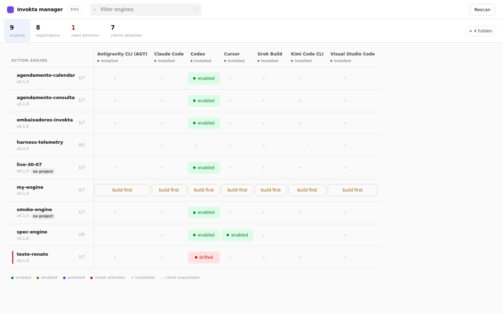
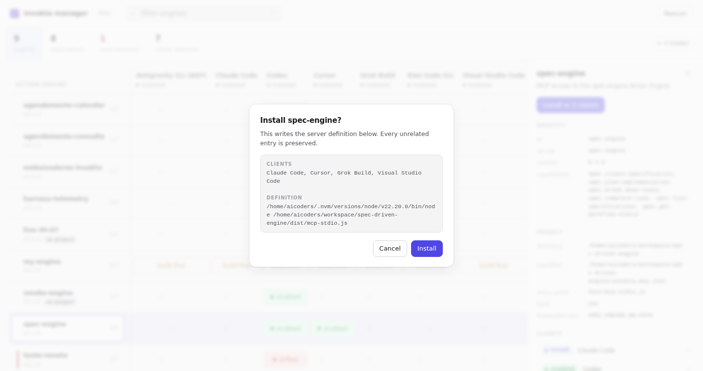

# @invokta/console

A local web console for the Action Engines installed on this machine. It answers
three questions in one place:

1. **Which engines exist here?** — engines registered by the installer, plus
   engine projects found on disk through their `invokta.mcp.json` manifest.
2. **Where is each one installed?** — one column per supported MCP client, with
   the live ownership status of every registration.
3. **Where could it be installed?** — every eligible empty cell, which turns
   install into a click instead of a command.

```bash
npx invokta-console
```



## Options

| Option | Effect |
| --- | --- |
| `--scan <directory>` | Add a directory to the Action Engine project scan. Repeatable. |
| `--port <number>` | Use a fixed loopback port instead of an ephemeral one. |
| `--no-open` | Print the console URL instead of opening a browser. |

Without `--scan`, the console scans the working directory plus the conventional
`workspace`, `workspaces`, `projects`, `Projects`, `code`, `dev`, `src`,
`repos`, and `source/repos` directories under the home directory.

## How a change is authorized

The console prints a URL containing a 256-bit session key. Possession of that
key is the authorization, and the session ends with the process. The server
binds the loopback interface only, pins its own `Host` and `Origin`, refuses a
cross-site fetch, sets no cookie, sends no CORS header, and serves one page
under a content security policy that forbids every external origin.

The page writes nothing until the operator accepts a dialog stating the action,
every client it touches, and the exact definition. That dialog catches a
mistaken click; it is not a second authorization, because the server enforces
the session key and anything holding the key can call the endpoint directly.



The key stays in the address bar for the life of the tab, so a screenshot, a
screen share, or a copied URL hands over the live session. That is deliberate:
stripping it would leave a reload with no credential. It is exposure to the
operator's own screen and history, not to the network — `Referrer-Policy:
no-referrer` and a policy forbidding every external origin close those. The
launch URL is also an argument to the browser process, so it appears in the
process table; `--no-open` avoids that.

The change then runs through `@invokta/client-config`, so the console and
`invokta-installer` share one writer: shared state lock, per-target lock,
revalidation, atomic configuration commit, atomic state commit, rollback on
failure. Each client is one independent transaction, and repeating an operation
is safe.

## What it never does

- Bind any interface other than loopback, or accept a remote connection.
- Import, execute, or reflect on an engine, or start an MCP transport.
- Open an outbound connection or download anything.
- Touch a server definition the installer does not own; drift and name
  conflicts fail closed exactly as they do in the terminal.
- Read an environment value into a response. Only variable names are ever
  persisted or displayed.

## Related

- [ADR 0019](../../docs/adr/0019-management-console-and-client-configuration.md) —
  the console boundary and the client configuration extraction.
- [`@invokta/installer`](../installer) — the interactive terminal equivalent.
